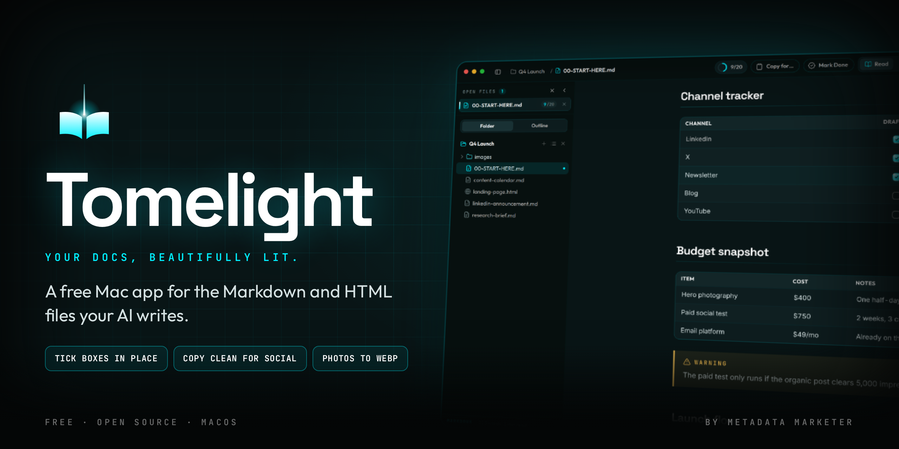
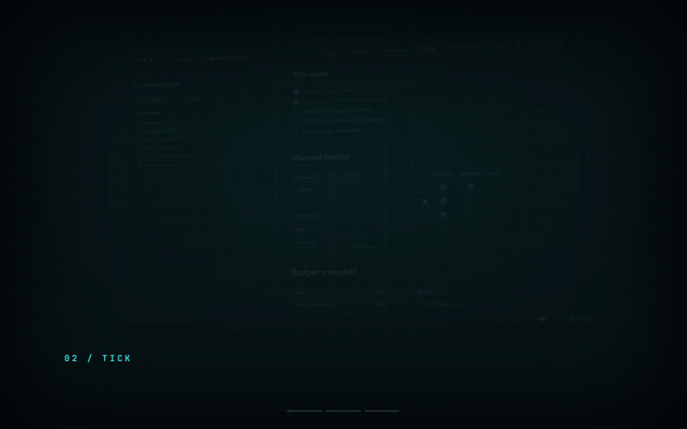
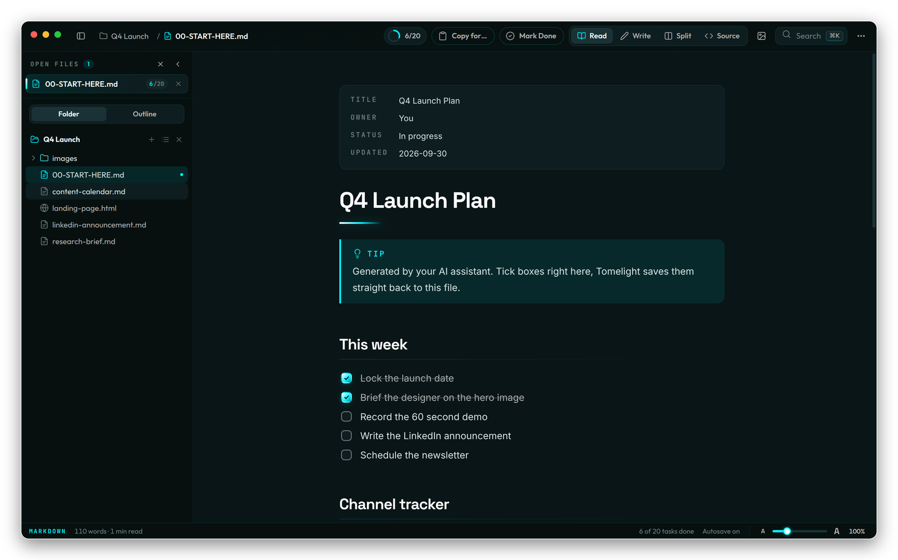
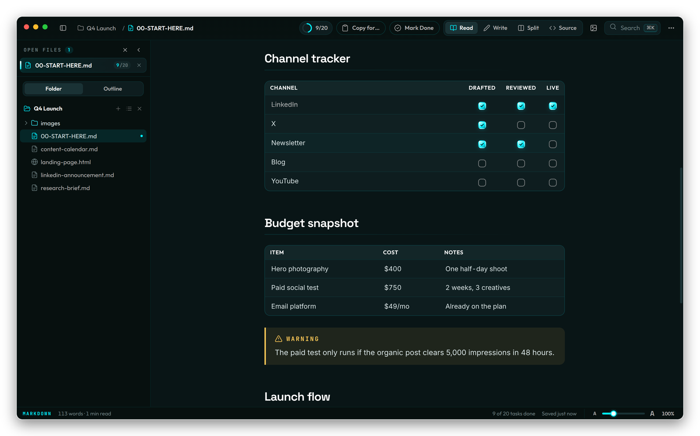
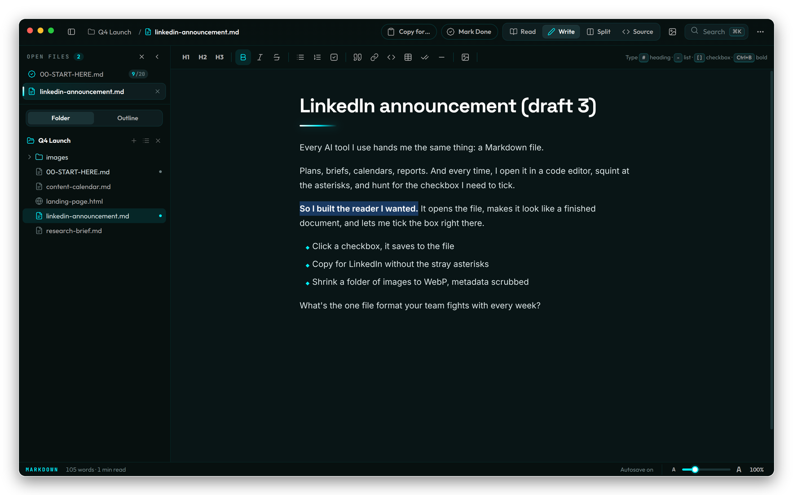
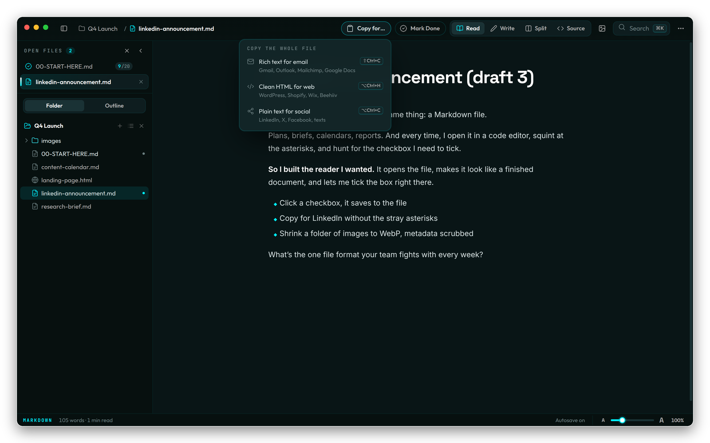
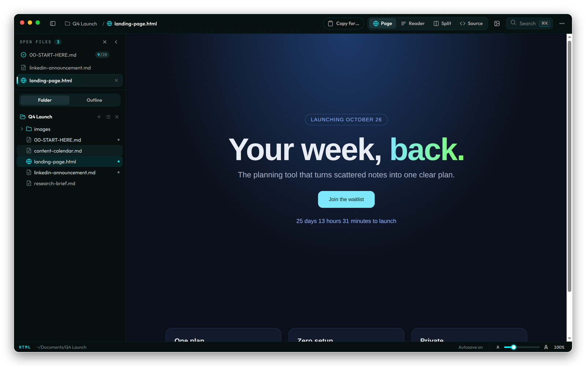
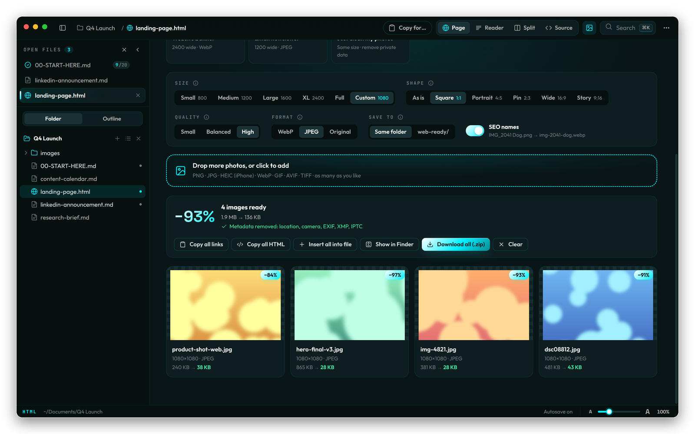
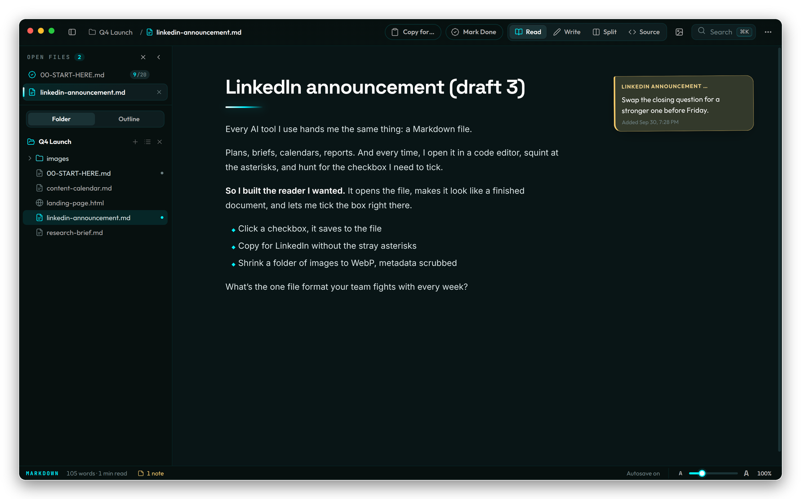
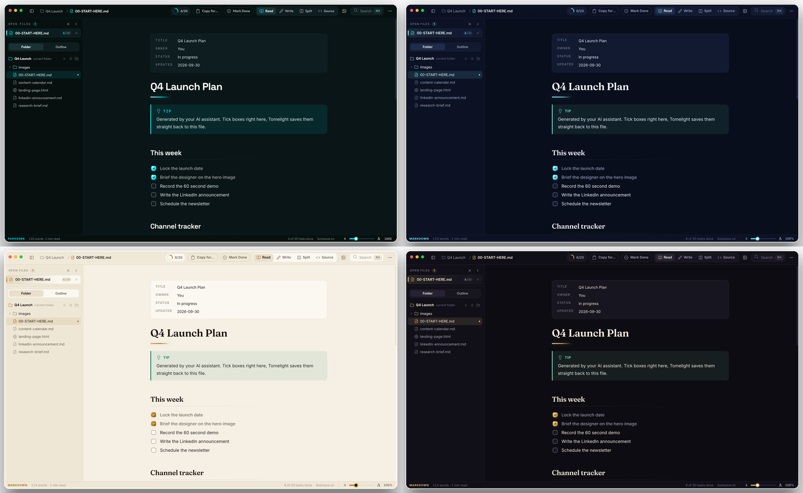

<p align="center">
  
</p>

<p align="center">
  <a href="https://github.com/aiprofitwire/tomelight/releases/latest"></a>
  
  
  
</p>

<p align="center"><b><a href="https://aiprofitwire.github.io/tomelight">aiprofitwire.github.io/tomelight</a></b></p>

<p align="center">
  
</p>

**Tomelight** is a free, open source Mac app that opens the Markdown and HTML files your AI tools hand you and shows them as clean, finished documents. Tick a checkbox and it saves straight back to the file. Copy the whole thing into an email, a website or a LinkedIn post without a single stray asterisk. Drop a folder of photos in and get small, clean WebP files back.

No account. No cloud. Nothing leaves your Mac.

## Why this exists

Every AI tool I use (ChatGPT, Claude, Gemini, the agents) hands me the same thing at the end of a task: a Markdown file. Launch plans, content calendars, research briefs, checklists. I kept opening them in a code editor just to read them, and I kept hunting through `- [ ]` brackets just to tick a box, which is a strange way to run a business in 2026.

Then I'd paste a draft into LinkedIn and watch it post with `**asterisks**` all over it, or upload photos to a sketchy converter site just to get a WebP.

So I built the reader I wanted for my own AI workflow, and now it's yours for free.

*Moe Sbaiti, [Metadata Marketer](https://metadatamarketer.com)*

## What it does

### Reads like a finished document
Double-click any `.md` file and it opens as a typeset page: real headings, tables, callouts, footnotes, code with syntax colors, front matter cards and Mermaid diagrams. Open a whole folder and your files sit in vertical tabs on the left, so long AI file names stay readable.



### Tick boxes in place, even inside tables
Click any checkbox and the file is saved instantly. Checkboxes inside table cells work too, which is exactly what content calendars and trackers need. **Mark Done** stamps the file as finished.



### Write like a doc, save as Markdown
**Write** mode feels like Google Docs: bold, lists, checklists, tables and links from a toolbar, no syntax to learn. It saves clean Markdown back to the file. Prefer the raw text? **Split** shows the source next to a live preview, and **Source** gives you the file exactly as it is. **Tidy** (`⌥⌘T`) fixes the usual AI and copy-paste damage: broken bullets, `#Heading` without a space, runs of blank lines.



### Copy for email, web or social
- **Rich text for email** keeps bold, lists and links but drops the styling, so it takes the font of Gmail, Outlook, Mailchimp or Google Docs.
- **Clean HTML for web** gives you tidy, class-free HTML for WordPress, Shopify, Wix or Beehiiv.
- **Plain text for social** swaps Markdown symbols for real bullets and shows your X (280, links count as 23) and LinkedIn (3,000) character counts.

It works on the whole file, a single section, or just what you highlight. **Paste as Markdown** (`⇧⌘V`) does the reverse: paste from a website or Google Docs and get clean Markdown.



### HTML opens like a real browser tab
HTML files render with their CSS, JavaScript, fonts, CDNs and charts working, each page walled off in its own sandbox. **Split** lets you edit the source and watch the page update live. **Reader** strips the design for a clean article view.



### Image Studio: photos to WebP, metadata scrubbed
Pick what you're making (blog post, Pinterest pin, Instagram post, Story, YouTube thumbnail, Shopify product photo, banner, newsletter) and Tomelight sets the size, shape, quality and format for you. Drop one photo or fifty, including iPhone HEIC files. Every file comes back with GPS location, camera details, EXIF, XMP and IPTC removed, and an SEO-friendly file name. Download them all as a zip or insert them straight into your doc.



### Sticky notes that never touch your file
Pin a note to any section of a Markdown or HTML file. Notes live inside Tomelight, never in the file, so your AI agent can rewrite the doc and your notes stay attached to their section.



### Themes
Nebula, Arcane, Parchment and Wire (the cyber-noir palette from Metadata Marketer), plus Auto to follow macOS.



## Install

1. Download the zip for your Mac from **[Releases](https://github.com/aiprofitwire/tomelight/releases/latest)**: `arm64` for Apple Silicon (M1 and newer), `x64` for Intel.
2. Unzip it and drag **Tomelight** into **Applications**.
3. Open it once. Tomelight isn't notarized by Apple yet, so macOS will say it can't verify the developer. Click **Done**, then open **System Settings → Privacy & Security**, scroll down and click **Open Anyway**. You only do this once.

Prefer Terminal? This clears the download flag so it opens normally:

```bash
xattr -dr com.apple.quarantine /Applications/Tomelight.app
```

**Make it your default Markdown app:** right-click any `.md` file, choose **Get Info**, set **Open with** to Tomelight, then click **Change All**.

Requires macOS 12 Monterey or later.

## Keyboard shortcuts

| Action | Keys |
|---|---|
| Open file / folder | `⌘O` / `⇧⌘O` |
| New file | `⌘N` |
| Quick open / command palette | `⌘P` / `⌘K` |
| Read / Write / Split / Source | `⌘1` / `⌘2` / `⌘3` / `⌘4` |
| Switch between Read and Write | `⌘E` |
| Close tab / reopen closed tab | `⌘W` / `⇧⌘T` |
| Mark done / complete all tasks | `⌘D` / `⇧⌘D` |
| Copy for email / web / social | `⇧⌘C` / `⌥⌘H` / `⌥⌘C` |
| Paste as Markdown | `⇧⌘V` |
| Tidy formatting | `⌥⌘T` |
| Image Studio | `⇧⌘I` |
| Add sticky note / show or hide notes | `⌥⌘N` / `⇧⌥⌘N` |
| Text size | `⌘+` / `⌘−` / `⌘0` |
| Find / focus mode | `⌘F` / `⇧⌘F` |
| Export as PDF / HTML | `⇧⌘P` / `⇧⌘E` |
| All shortcuts | `⌘/` |
| Toggle sidebar / folder / outline | `⌘\` / `⇧⌘1` / `⇧⌘2` |

## Privacy

Tomelight makes no network requests of its own. There are no accounts, no analytics and no update pings. Images are processed on your Mac. The only things that reach the internet are what an HTML page you open asks for itself (its own fonts or scripts), exactly like a browser.

## Try it with the example folder

The [`examples/q4-launch`](examples/q4-launch) folder is a small AI-style workspace: a launch plan with task and table checkboxes, a content calendar, a research brief with a Mermaid diagram, a social post draft, an HTML landing page and a few photos for Image Studio. Open the folder with `⇧⌘O` and click around.

## Build from source

Requires Node 20 or newer.

```bash
npm install
npm start               # run in development
npm test                # unit tests
npm run package         # Apple Silicon build in release/
npm run package:x64     # Intel build
```

Packaging on macOS ad-hoc signs the app automatically. If you package on Linux, sign it with [rcodesign](https://github.com/indygreg/apple-platform-rs): `rcodesign sign release/Tomelight-darwin-arm64/Tomelight.app`.

## Roadmap

- Quick Look preview for `.md` files in Finder
- A `tomelight` command for opening files from Terminal
- Homebrew install (`brew install --cask tomelight`)
- Notarized builds
- Windows and Linux builds

Have an idea? [Open an issue](https://github.com/aiprofitwire/tomelight/issues/new/choose).

## Contributing

Bug reports, ideas and pull requests are welcome. Start with [CONTRIBUTING.md](CONTRIBUTING.md).

## Credits

Built by [Moe Sbaiti](https://metadatamarketer.com) at Metadata Marketer.

Made with Electron, markdown-it, CodeMirror 6, TipTap, highlight.js, Mermaid, DOMPurify, Turndown and fflate. Fonts: Fraunces, Inter, Literata, JetBrains Mono, Space Grotesk and Outfit (SIL Open Font License). Icons adapted from Lucide (ISC).

The name: a *tome* is a big, important book. Tomelight puts a light on yours.

## License

[MIT](LICENSE)
