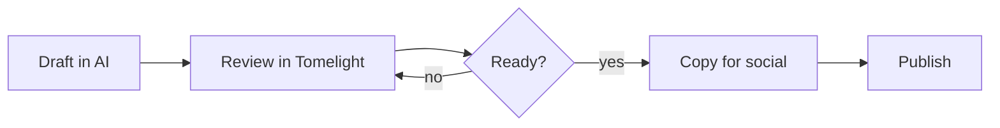

# Q4 Launch Plan

> [!TIP]
> Generated by your AI assistant. Tick boxes right here, Tomelight saves them straight back to this file.

## This week

- [x] Lock the launch date
- [x] Brief the designer on the hero image
- [ ] Record the 60 second demo
- [ ] Write the LinkedIn announcement
- [ ] Schedule the newsletter

## Channel tracker

| Channel | Drafted | Reviewed | Live |
|---|---|---|---|
| LinkedIn | [x] | [x] | [ ] |
| X | [x] | [ ] | [ ] |
| Newsletter | [x] | [ ] | [ ] |
| Blog | [ ] | [ ] | [ ] |
| YouTube | [ ] | [ ] | [ ] |

## Budget snapshot

| Item | Cost | Notes |
|---|---|---|
| Hero photography | $400 | One half-day shoot |
| Paid social test | $750 | 2 weeks, 3 creatives |
| Email platform | $49/mo | Already on the plan |

> [!WARNING]
> The paid test only runs if the organic post clears 5,000 impressions in 48 hours.

## Launch flow

